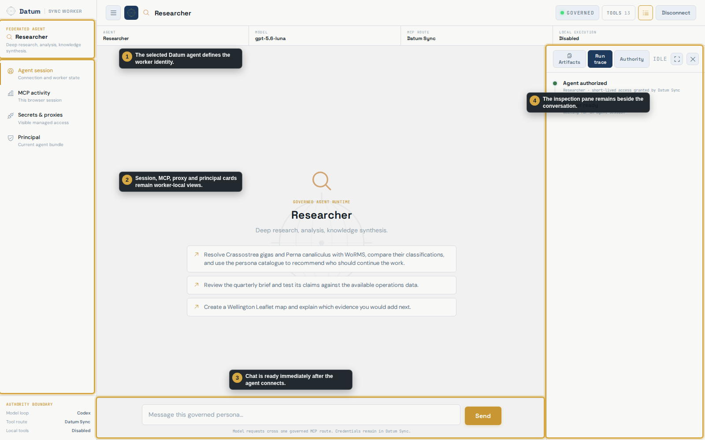
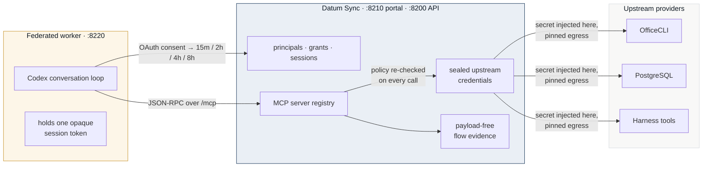
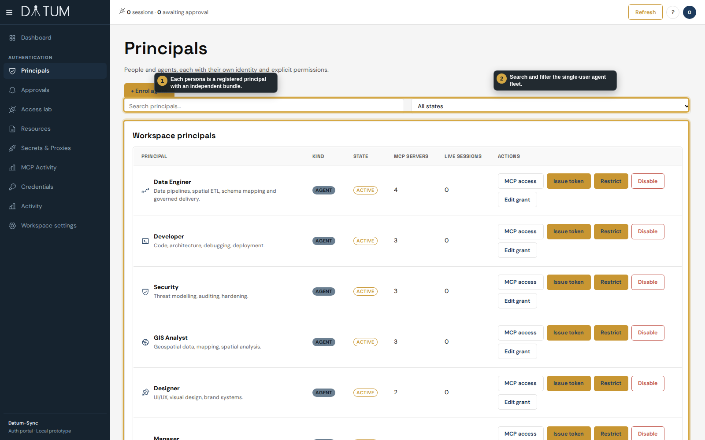
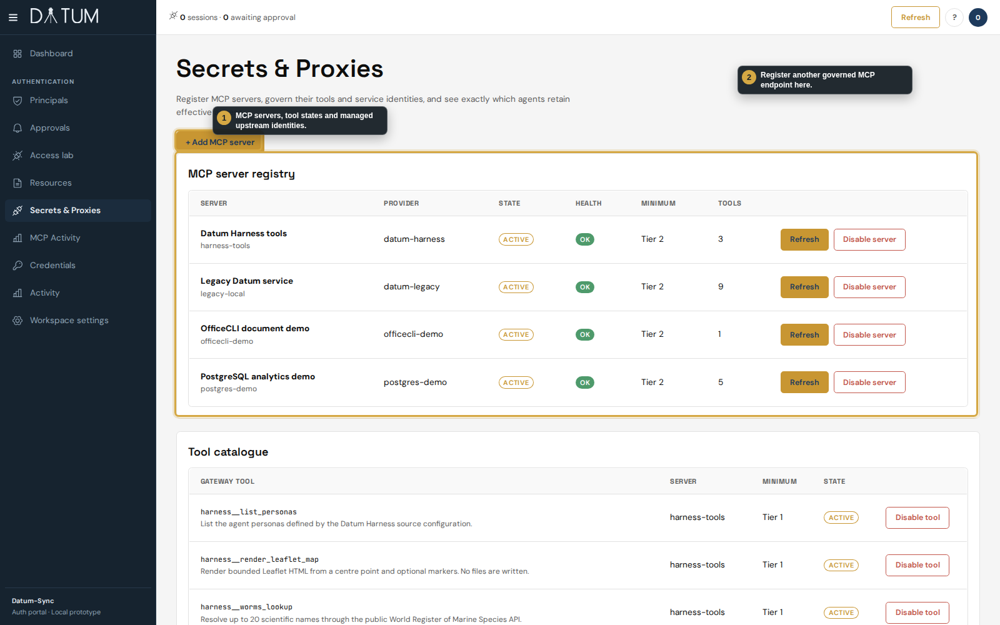
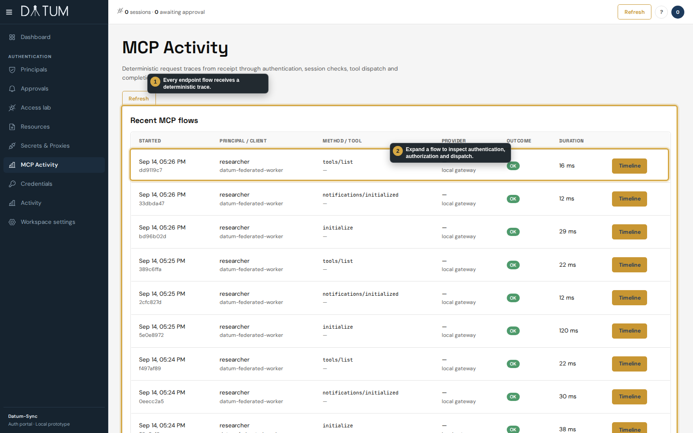
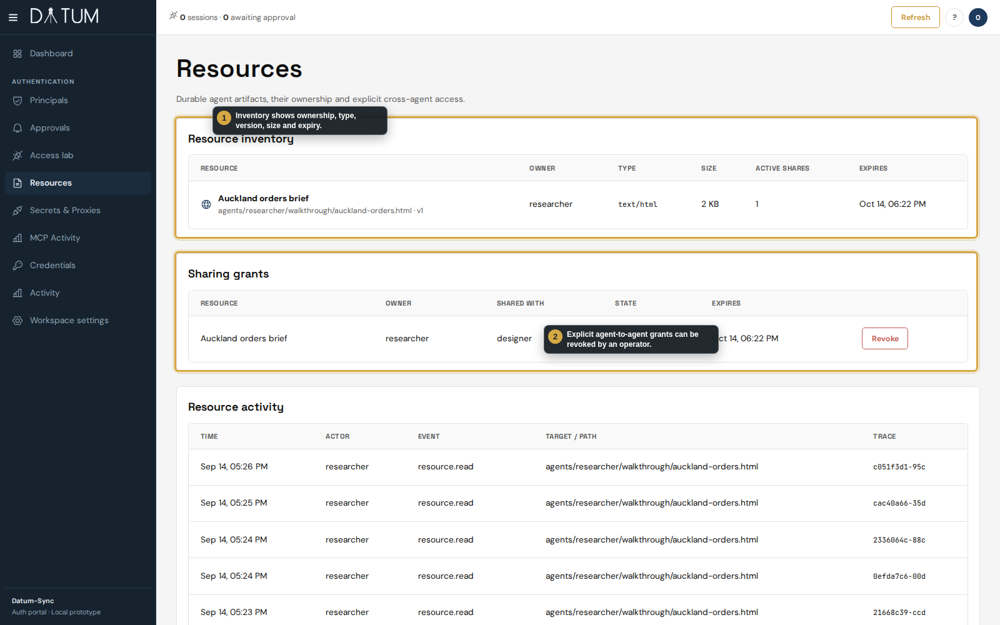
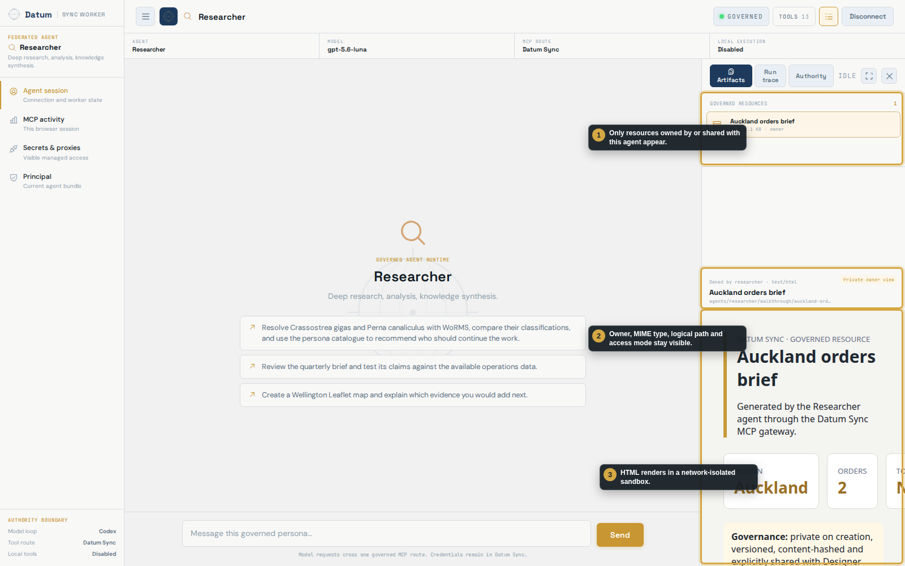

<p align="center">
  
</p>

<h1 align="center">Datum Sync</h1>

<p align="center">
  <strong>The authority plane for a fleet of AI agents.</strong><br>
  Agents get an identity, a permission bundle and one governed route to tools.<br>
  They never get the credentials behind those tools.
</p>

<p align="center">
  
  
  
  
  
  
</p>

<p align="center">
  
</p>

<p align="center"><sub>The federated worker: a small Codex client that holds no secrets. Every tool it uses is issued, watched and revocable in Datum Sync.</sub></p>

---

## The idea in one diagram

**Datum Sync contains no LLM.** The model runs in a small, replaceable worker. Datum Sync decides what that worker may do, injects secrets server-side, records every call as payload-free evidence, and can revoke any of it without restarting anything.



<table>
<tr>
<td width="50%" valign="top">

**Datum Sync owns**
- principals, grants, sessions
- the MCP server registry, per-tool state
- managed upstream credentials (AES-256-GCM, rotating keys)
- governed resources
- the audit trail and MCP flow evidence

</td>
<td width="50%" valign="top">

**The worker owns**
- the conversation loop and the model
- the chat UI and a session-local trace
- **one** short-lived agent token — nothing else

It never sees a secret value, another agent's resources, or the fleet inventory. Swap it for any MCP client; nothing about policy moves with it.

</td>
</tr>
</table>

---

## What it does

<table>
<tr>
<td width="50%">

</td>
<td width="50%" valign="top">

### Agents are principals
Every agent has an owner, a lifecycle state, a grant and an audit trail. Enrolment is single-use and needs human approval. Seven demo personas — Manager, Developer, Researcher, Designer, Security, GIS Analyst, Data Engineer — each carry their own tool bundle.

**Consent, not configuration.** A worker connects through OAuth; the operator picks the agent and a 15-minute, 2-, 4- or 8-hour session. The deadline is absolute. Refresh cannot extend it.

</td>
</tr>
<tr>
<td width="50%" valign="top">

### One governed route for MCP and credentials
Operators register MCP servers once. Tools are discovered, enabled per tool with a minimum tier, and granted to agents **by name**. Upstream secrets are write-only, versioned, rotated only after a live probe, and injected at dispatch.

Agents receive explicit, revocable *use* grants — never the value. Outbound calls go through a pinned-IP transport that refuses private ranges and redirects.

</td>
<td width="50%">

</td>
</tr>
<tr>
<td width="50%">

</td>
<td width="50%" valign="top">

### Evidence without payloads
Every MCP call leaves a deterministic timeline:

`rpc.parsed → auth.accepted → session.validated → tool.authorized → upstream.started → upstream.completed → tool.completed`

— or `tool.denied`. No prompts, no arguments, no results, no secrets. Denied calls sit in the same stream as successful ones, which is what makes the trail safe to keep and export.

</td>
</tr>
<tr>
<td width="50%" valign="top">

### Governed outputs
Agents save versioned, private artifacts with `resources_create` and share them with one named agent for a bounded time. The worker renders HTML in a network-isolated sandbox. Operators see ownership and shares — and can revoke.

<p></p>

</td>
<td width="50%">

</td>
</tr>
</table>

### Revocation is immediate, and it's four separate levers

| Lever | Where | Effect on the next call |
|---|---|---|
| **Tool** | Secrets & Proxies → Disable tool | leaves the catalogue; a call is `tool.denied` |
| **Server** | Secrets & Proxies → Disable server | every tool on that provider is gone |
| **Grant** | Secrets & Proxies → Revoke server access | this agent loses the upstream credential; others keep theirs |
| **Agent** | Principals → Disable / Restrict | every credential revoked, every session closed |

None of these restart or rotate anything inside the worker, because the worker was never given anything to rotate.

---

## Quickstart

<details open>
<summary><strong>Run the portal against your own PostgreSQL</strong></summary>

Requires Python 3.11+ and PostgreSQL 16 with PostGIS and pgcrypto (`docker-compose.yml` starts one on `:5435`).

```bash
python -m venv .venv && source .venv/bin/activate
pip install -r requirements.txt
cp .env.example .env                      # set PUBLIC_URL; DATABASE_URL matches docker-compose
docker compose up -d db
export DATUM_SYNC_SECRET_KEY_01=$(python -m datum_sync.crypto)   # seals managed credentials
export LEGACY_MCP_TOKEN=$(python -c 'import secrets;print(secrets.token_urlsafe(32))')
python -m datum_sync.migrate              # migrations 001–023
python -m datum_sync.portal_seed          # creates the operator → .runtime/operator.txt
uvicorn datum_sync.portal:app --host 127.0.0.1 --port 8210
```

Sign in at <http://127.0.0.1:8210> as `operator`.
</details>

<details>
<summary><strong>Run the whole demonstration stack</strong></summary>

Portal, worker, the legacy adapter and the demo MCP providers on a private PostgreSQL cluster, with the persona fleet seeded:

```bash
python demo/manage.py start
python demo/provision_personas.py --register
```

Open the worker at <http://127.0.0.1:8220>, **Connect agent** → `researcher` → pick a session length, then ask it to list the Office documents it can access. The step-by-step runbook is [`docs/prototype/INSTRUCTIONS.md`](docs/prototype/INSTRUCTIONS.md); the talk track is [`docs/demo-talk-track.md`](docs/demo-talk-track.md).
</details>

<details>
<summary><strong>Run the tests</strong></summary>

```bash
pytest -q                                   # service suite (needs the database)
python tests/break_the_guard.py             # proves each guard is load-bearing
python tests/browser_smoke.py               # Playwright, needs a running server
python tests/flow_geometry.py               # layout parity with the reference UI
pytest worker/tests                         # the worker, no database needed
python demo/manage.py test                  # portal + worker suites on a disposable database
```

Stop the worker before the service suite — a live worker claims the tests' jobs. `CLAUDE.md` explains the gates and why a skipped test reads as a passing one.
</details>

---

## Auth model

Five tiers control what a principal — human or agent — can do. A grant can only narrow what a tier allows.

| Tier | Role | Access |
|:---:|---|---|
| 1 | Read-only | Authenticate, read public state |
| 2 | Internal | Internal connections and vault paths; MCP catalogue (`mcp`) |
| 3 | Read/write | Execute workspaces, write scoped vault paths; `mcp:operate` |
| 4 | Admin | Accounts, connections, automations, MCP servers |
| 5 | Superuser | Full platform access |

Elevation is a separate, time-boxed OAuth device-flow request that a human approves.

---

## Repository map

```
datum_sync/            the service
  portal.py            auth portal, consent, sessions, built-in MCP tools     :8210
  api.py               REST API, jobs, hosted services, vault                 :8200
  federation.py        MCP federation and the persistent tool catalogue
  credential_access.py write-only upstream credentials, requests, grants
  mcp_observe.py       deterministic, payload-free flow evidence
  resources.py         governed, shareable artifacts
  egress.py · proxy.py pinned-IP outbound transport
  static-v2/           the operator UI   portal_static/  the auth portal UI
migrations/            001–015 original schema · 016–023 agent auth plane (additive)
worker/                the federated Codex worker (app.py, codex_bridge.py, datum_sync_client.py)
demo/                  manage.py start|stop|test · provision_personas.py · personas.py · verify.py
docs/architecture.md   Datum Sync vs the worker, request path, production gap list
docs/demo-talk-track.md
docs/walkthrough/      six-page product brochure (OfficeCLI) · Playwright demo recorder · screenshots
docs/prototype/        runbooks · docs/review/  security review record
spec/                  design documents — skills.md · transcripts.md · dashboards.md · the holonic framing
tests/                 pytest suite + break_the_guard.py · browser_smoke.py · flow_geometry.py
```

---

## Where it's going

Three specs on this branch describe the next increments, each built on the same principal / grant / session / evidence records:

| Spec | What it adds |
|---|---|
| [`spec/skills.md`](spec/skills.md) | Provider-agnostic skills — fleet, shared or single-agent scope, authorised by default, delivered through MCP prompts, resources and two baseline tools |
| [`spec/transcripts.md`](spec/transcripts.md) | Session transcripts in PostgreSQL, sealed at rest, isolated per agent by row-level security; nothing durable left on the worker host |
| [`spec/dashboards.md`](spec/dashboards.md) | Persistent live dashboards fed by governed streams — declared card layouts, hosted URLs, live cards in the worker |

And the honest production list — identity, least privilege, credential brokering, egress control, evidence, isolation — with what's done and what remains, is in [`docs/architecture.md`](docs/architecture.md#what-a-production-agent-gateway-must-get-right).

---

## Design principles

- **The gateway enforces, the agents think.** No model inside Datum Sync; no credentials inside the worker.
- **Everything is a principal.** Humans and agents register the same way and are governed by the same tier, grant, session and audit records.
- **Deny by default, revoke immediately.** Tools, servers, grants and agents are separate controls; each takes effect on the next call.
- **Evidence without payloads.** The audit trail proves what happened without storing what was said.
- **Holonic.** Datum Sync is the head holon of a moderated group; each agent runtime is a member with local autonomy inside the boundary it was granted — see [`PROPOSAL.md`](PROPOSAL.md) and [`spec/holonic-shacl-analysis.md`](spec/holonic-shacl-analysis.md).

<p align="center"><sub>FastAPI · PostgreSQL + PostGIS · asyncpg, no ORM · MCP Streamable HTTP · OAuth 2.1 PKCE + device flow · pg_notify SSE · AES-256-GCM sealed secrets · subprocess-isolated workspaces</sub></p>
